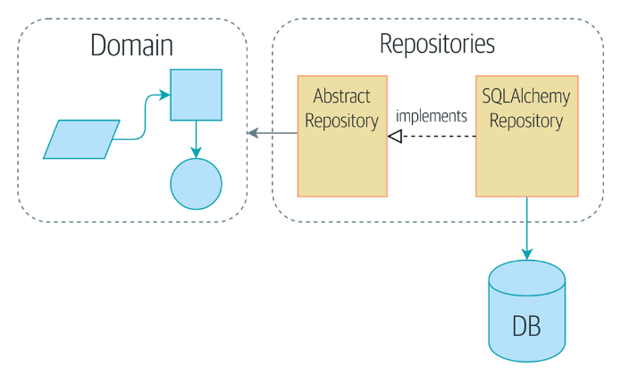
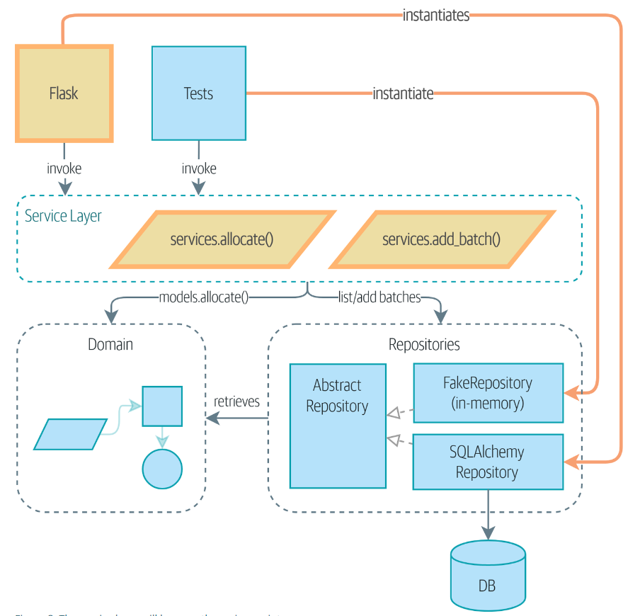

# fastapi-crms-demo

## Overview

This code demo attempts to gives an overview of the main design concepts from the book **Architecture Patterns with Python** available at https://www.cosmicpython.com. The goal is to build a simple CRMS (Content Rights Management System) using a DDD (Domain Driven Design) approach.

## Core Concepts

### Domain Model

The domain model is the mental map that business owners have of their business. It describes real world objects or entities, their rules, and the relationships between them. Suppose we are a media distrubtor. A studio provides us a license to distribute their content that is the basis for some contractual agreement that was signed. From the license, we can create offers and assigned them to individual pieces of content. You can think of the license as holding the broad terms of the agreement, like what devices content can be distributed to. The offer is internal and contains information like price. Every piece of content needs to be assgned at least one offer and an offers start and end date cannot overlap.

So relating this back to the domain model, a **license** has business logic or rules since it can create **offers** and assign it to a piece of content. Then a license has a one-to-many _relationship_ with its offers. For the purposes of this example, a license is _entity_ because along with it having business logic, we can change the terms of the license, and it will still be the same license. However, the offer is defined by its data, changing its data makes it a new offer.

So DDD is a top-down approach design philosophy for building software where we gather business requirements and construct the domain model first. For example, the lower level database schema design _depends on_ the higher level domain model. The idea is that this allows for more flexibilty when dealing with ever changing business requirements.

### Encapsulation and Abstraction

We **encapsulate** behavior and data from the the layer above. The object that does the encapsulation is called an **abstraction** or interface. This has two main benefits:

1. The code using the abstraction doesnt care about its implementation details. So as long as the API contract remains the same, we can change the encapsulated code without impacting the code using the abstraction. This can make the codebase more **_maintainable_**, because otherwise we would need to make changes to possibly many different places.

2. It makes the code more **_testable_**. We can mock the abstraction instead of needing to mock all the potential dependncies that are part of the lower level module.

3. So long as our abstractions have good names, the code is now more **_readable_** since we aren't getting bogged down in the nitty gritty implementation details. If we just need to get an idea of what a piece of code does at a high level, we can do that easier.

### The Dependency Inversion Principle (DIP)

1. High level modules should not depend on low level modules. Both should depend on abstractions.

2. TODO

## The Repository Pattern



Most people are familiar with the _Model-View-Controller_ (**MVC** pattern). In MVC the controller is the business logic layer and the model is like the data access layer. When you want to write some business logic, you import the model, and use a database session object to perform a database operation using that model. Now our business and data layers are tightly coupled because the business layer _depends_ on the data layer. If we add a column to our database, we need to reflect that every place the model is used. Also, it makes sense that the business layer should not care about lower level implementation details like the database session.

```python
from flask import Flask, request
from flask_sqlalchemy import SQLAlchemy

# This would likely be imported
app = Flask(__name__)
app.config['SQLALCHEMY_DATABASE_URI'] = 'sqlite:////tmp/test.db'
db = SQLAlchemy(app)

# This would be imported from the data layer
class User(db.Model):
    id = db.Column(db.Integer, primary_key=True)
    username = db.Column(db.String(80), unique=True, nullable=False)

@app.route('/user', methods=['POST'])
def create_user():
    username = request.json.get('username')
    user = User(username=username)
    db.session.add(user)
    db.session.commit()
    return {'id': user.id}, 201
```

The _Repository_ pattern builds on MVC by creating an abstract interface (the repository) over peristant storage effectively decoupling both layers (TODO: Link code in repository). In doing so it satisfies the first DIP principle since:

- The high-level module (business logic layer) depends on the repository abstraction to retrieve or persist domain objects. It doesn't need to know about the specifics of how the data is stored or retrieved.

- The low-level module (data access layer) also depends on the repository abstraction because it must implement the interface. The data access layer provides the concrete implementation of the repository by adhering to the abstractions contract.

One of the main benefits of the repository pattern is better testing. In the MVC sample code we would need to monkeypatch (replace objects at runtime) our `db.session` methods. Of course, the code could be much more complicated and require more patching to run the test. Overall this makes our test suite more difficult maintain. On the other hand, with the Repository pattern, we can have a concrete implementation FakeRepository which performs all the same database operations but in memory. For example, would inject (i.e. dependency injection) the repository into the business layer as an argument from say the API entry point where the respository would be instantiated.

### _Some quick notes on testing terminology:_

**Mock:** A mock verifies that a test has in interacted with an object in a certain way. For example, you could mock a function expected to upload a file given a file path. It return `True` if the file exists otherwise it raises an `Exception`. It tests _expectations_ for _dependencies_.

**Spy:**

**Stub:** A stub is the simplest kind of test double. It just returns a pre-defined response. It is typically used when we need to isolate the system under test from from dependencies that dont impact the behavior we are testing.

**Fake:**

## Adding the Service Layer


