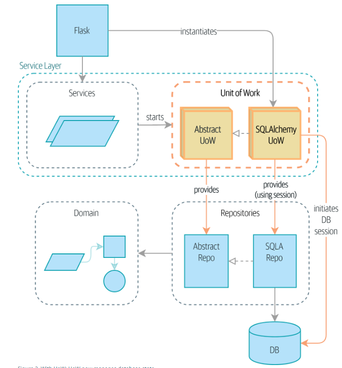
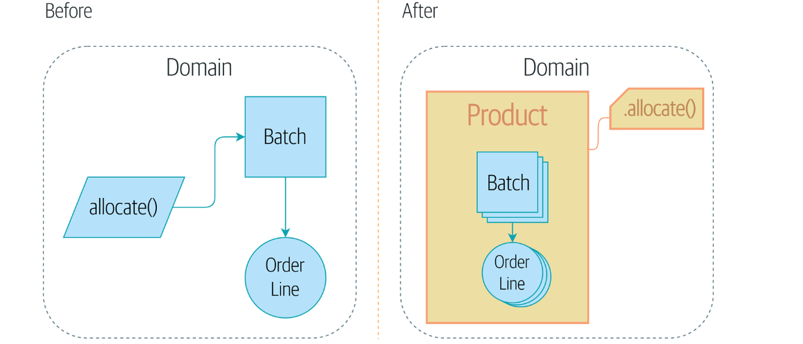
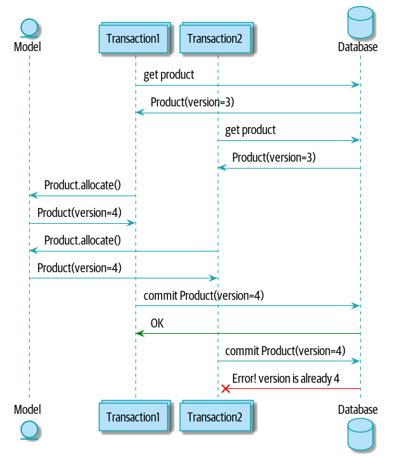

# fastapi-crms-demo

## Overview

This code demo attempts to gives an overview of the main design concepts from the book **Architecture Patterns with Python** available at https://www.cosmicpython.com. The goal is to build a simple CRMS (Content Rights Management System) using a DDD (Domain Driven Design) approach.

1. [Core Concepts](#core-concepts)
2. [Repository Pattern](#the-repository-pattern)
3. [Service Layer](#adding-the-service-layer)
4. [Unit of Work Pattern](#unit-of-work-pattern)
5. [Aggregates and Consistency Boundaries](#aggregates-and-consistency-boundaries)
6. [Final Remarks](#final-remarks)

## Core Concepts

### Domain Model

The domain model is the mental map that business owners have of their business. It describes real world objects or entities, their rules, and the relationships between them. Suppose we are a media distrubtor. A studio provides us a license to distribute their content that is the basis for some contractual agreement that was signed. From the license, we can create offers and assigned them to individual pieces of content. You can think of the license as holding the broad terms of the agreement, like what devices content can be distributed to. The offer is internal and contains information like price. Every piece of content needs to be assgned at least one offer and an offers start and end date cannot overlap.


Relating this back to the domain model, a **license** has business logic or rules around generating **offers**. Then a license is considered an _entity_ because it has business logic and when we change the terms of the license, it is still considered the _same_ license. For the purposes of this example, we consider an offer to be a _value object_ meaning that it is defined by its data. If we change a field in an offer, then it is considered a completely different offer.

Then a license has a one-to-many _relationship_ with its offers. For the purposes of this example, a license is _entity_ because along with it having business logic, we can change the terms of the license, and it will still be the same license. However, the offer is defined by its data, changing its data makes it a new offer.

DDD is a top-down approach design philosophy for building software where we gather business requirements and construct the domain model first. You may notice that a license has a one-to-many relationship with its offers or that and offer would have a FK to a license. These are implementation details we don't yet care about because we let the business requirements drive these decisions. We write the busines logic for our domain models then decide what the database schema needs. We want the lower level schema to _depends on_ the higher level domain model. This also allows for more flexibilty when dealing with ever changing business requirements.

### Encapsulation and Abstraction

We **encapsulate** behavior and data from the the layer above. The object that does the encapsulation is called an **abstraction** or interface. This has two main benefits:

1. The code using the abstraction doesnt care about its implementation details. So as long as the API contract remains the same, we can change the encapsulated code without impacting the code using the abstraction. This can make the codebase more **_maintainable_**, because otherwise we would need to make changes to possibly many different places.

2. It makes the code more **_testable_**. We can mock the abstraction instead of needing to mock all the potential dependncies that are part of the lower level module.

3. So long as our abstractions have good names, the code is now more **_readable_** since we aren't getting bogged down in the nitty gritty implementation details. If we just need to get an idea of what a piece of code does at a high level, we can do that easier.

### The Dependency Inversion Principle (DIP)

1. High level modules should not depend on low level modules. Both should depend on abstractions.

2. TODO

### Testing

DDD and the architecure patterns here tend to work well with TDD (Test Driven Design) because of the focus on behavior, and the isolation of each module through abstraction. Here is some useful terminology for test doubles:

**Mock:** A mock verifies that a test has in interacted with an object in a certain way. For example, you could mock a function expected to upload a file given a file path. It return `True` if the file exists otherwise it raises an `Exception`. It tests _expectations_ for _dependencies_.

**Spy:** A spy provides information on how an object was interacted with. For example, it could track how many times the object was called or what paramaters were passed to it.

**Stub:** A stub is the simplest kind of test double. It just returns a pre-defined response. It is typically used when we need to isolate the system under test from from dependencies that dont impact the behavior we are testing.

**Fake:** A fake is a full implementation of the object, but this implementation is done in a way that is faster or utilizes shortcuts for the purpose of testing. For example, using an in-memory database rather than a persistant database.

## The Repository Pattern


Most people are familiar with the _Model-View-Controller_ (**MVC** pattern). In MVC the controller is the business logic layer and the model is like the data access layer. When you want to write some business logic, you import the model, and use a database session object to perform a database operation using that model. Now our business and data layers are tightly coupled because the business layer _depends_ on the data layer. If we add a column to our database, we need to reflect that every place the model is used. Also, it makes sense that the business layer should not care about lower level implementation details like the database session.

```python
from flask import Flask, request
from flask_sqlalchemy import SQLAlchemy

# This would likely be imported
app = Flask(__name__)
app.config['SQLALCHEMY_DATABASE_URI'] = 'sqlite:////tmp/test.db'
db = SQLAlchemy(app)

# This would be imported from the data layer
class User(db.Model):
    id = db.Column(db.Integer, primary_key=True)
    username = db.Column(db.String(80), unique=True, nullable=False)

@app.route('/user', methods=['POST'])
def create_user():
    username = request.json.get('username')
    user = User(username=username)
    db.session.add(user)
    db.session.commit()
    return {'id': user.id}, 201
```

The _Repository_ pattern builds on MVC by creating an abstract interface (the repository) over peristant storage effectively decoupling both layers (TODO: Link code in repository). In doing so it satisfies the first DIP principle since:

- The high-level module (business logic layer) depends on the repository abstraction to retrieve or persist domain objects. It doesn't need to know about the specifics of how the data is stored or retrieved.

- The low-level module (data access layer) also depends on the repository abstraction because it must implement the interface. The data access layer provides the concrete implementation of the repository by adhering to the abstractions contract.

One of the main benefits of the repository pattern is better testing. In the MVC sample code we would need to monkeypatch (replace objects at runtime) our `db.session` methods. Of course, the code could be much more complicated and require more patching to run the test. Overall this makes our test suite more difficult maintain. On the other hand, with the Repository pattern, we can have a concrete implementation FakeRepository which performs all the same database operations but in memory. For example, would inject (i.e. dependency injection) the repository into the business layer as an argument from say the API entry point where the respository would be instantiated.

## Adding the Service Layer


At this point, we have FastAPI (entrypoint) doing quite a bit of work; fetching from the repository, validating input against database state, handling errors, calling domain logic, and finally commiting the result. To keep our entry point clean, we split out this logic out into a seperarte _Service_ layer which is responsible for _orchistrating_ these actions. This way the entry point is only responsible for parsing the request body, calling the service, and handling any errors the service may throw. To help with orchistrating, we can create _service functions_ or helpers that encapsulate business logic between different domain models and possibly other services.

## Unit of Work Pattern



With the _Unit of Work_ (UOW) pattern is an abstraction over _atomic_ operations like the _Repository_ pattern is an abstraction over persistant storage. Now the service layer only accesses the data through the UOW and orchistrates the business logic by starting the UOW, accessing data through the UOW, and importing the domain models. This gives us three main benefits:

1. Sets a stable snapshot of the data so objects don't change halfway through an operations. Basically, the UOW creates a single transaction for our data operations and business logic. If data operations were broken up into their own transactions, this could potentially cause major concurrency issues and inconsistant state (more on this in _Aggregates and Conistency Boundries_). Transactions are also atomic because they must fully complete or fail.

2. A simple API to our persistance concerns and a handy place to get a repository.

3. The UOW is an abstract class, so just like the repository, we can create a FakeUnitOfWork for testing our service layer.

## Aggregates and Consistency Boundaries

A _constraint_ is a rule that restricts the possible states our model can get into. _invariant_ is a condition on a constraint that must _always hold true_. For example, suppose we implment the constraint that _offer_ start and end dates cannot overlap. With only a single database session at any given time, the invariant that offers cannot overlap must always be _true_ is easy to maintain with the correct implementation. But what if we had two database sessions creating offers at the same time? We can't just start locking tables to make sure the data is _consistant_ because that would incur a huge performance cost.

To help deal with this issue we can use the _Aggregate_ pattern to form a _consistancy boundry_ which ensures that all our invariants are satisfied. An aggregate defines an isolated group of domain models that will be treated as a single unit with respect to data changes. Lets call our aggregate _Contracts_ where the aggregate root is _Licenses_. To form a consistancy boundry for Contracts, we add a _lock_ to licenses. The lock can be any data field, but usually a version number makes sense. Whenever we attempt to modify any data inside our contract aggregate, we try to increment the version.

<!--  -->



Using the above diagram as a reference, we can think of two transactions starting at nearly the same time. Because neither has commited, they both see that an offer can be created after 2025-08-11 and they both grab the same license version. The fastest transaction finishes by incrementing the license version and commiting. When the slower transaction tries to increment the license version, it fails. This idea of treating values as locks and letting transactions fail is a way of implementing _optimistic concurrency_. While we hope that a transaction doesn't fail, its better than it succeding and leaving the data in an inconsitant state. We simply fail, give the client the the updated state and the opportunity to retry the transaction.

Optimistic concurrency works with `READ COMMITED` (usually the default transaction isolation level) and is therefore more performant that setting the transaction level up one level to `REPEATABLE READ`. Increasing isolation levels is an example of _pessemistic concurrency_ and is still a valid option or maybe even preferable in some cases. From the example it may not be completely clear why the slow transaction fails on the version update. The reason is that the query keeps version in the `WHERE` clause. Remember that we are treating all these operations as a single transaction in the UOW, but the UOW is an abstraction. In reality every data access is its own transaction. So when the transaction gets to the final step of updating the version, it fails because there is no `id = 1 AND version = 123` (for that id the version has already been updated by the faster transaction).

```sql
UPDATE products
SET quantity = quantity - 1, version = version + 1
WHERE id = 1 AND version = 123;
```

TODO: Explain how the repository should now only return aggregate data.

TODO: Explain how service functions can be used for business logic across aggregates.

## Final Remarks
